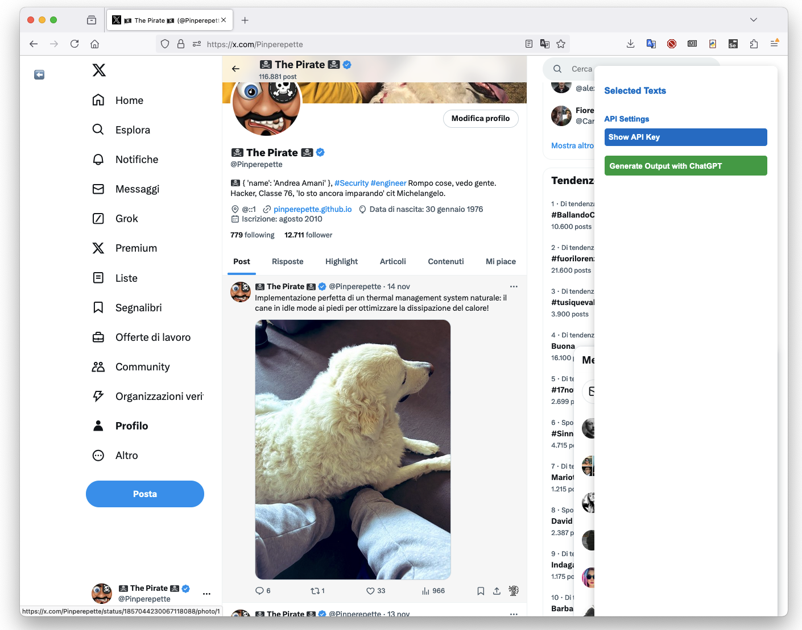
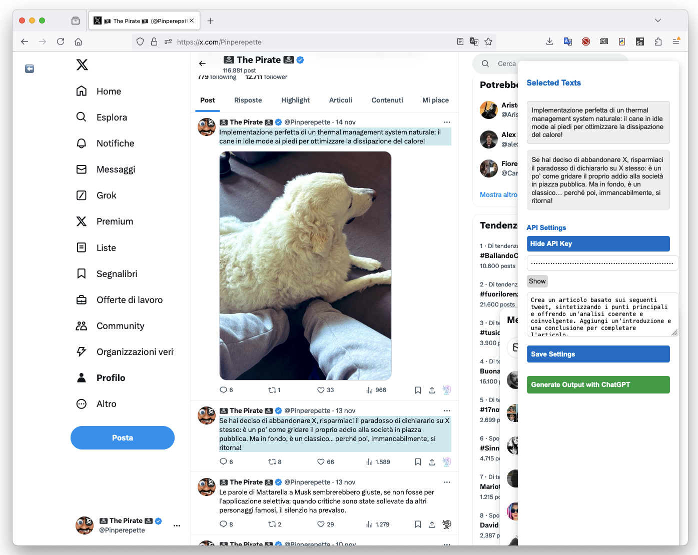
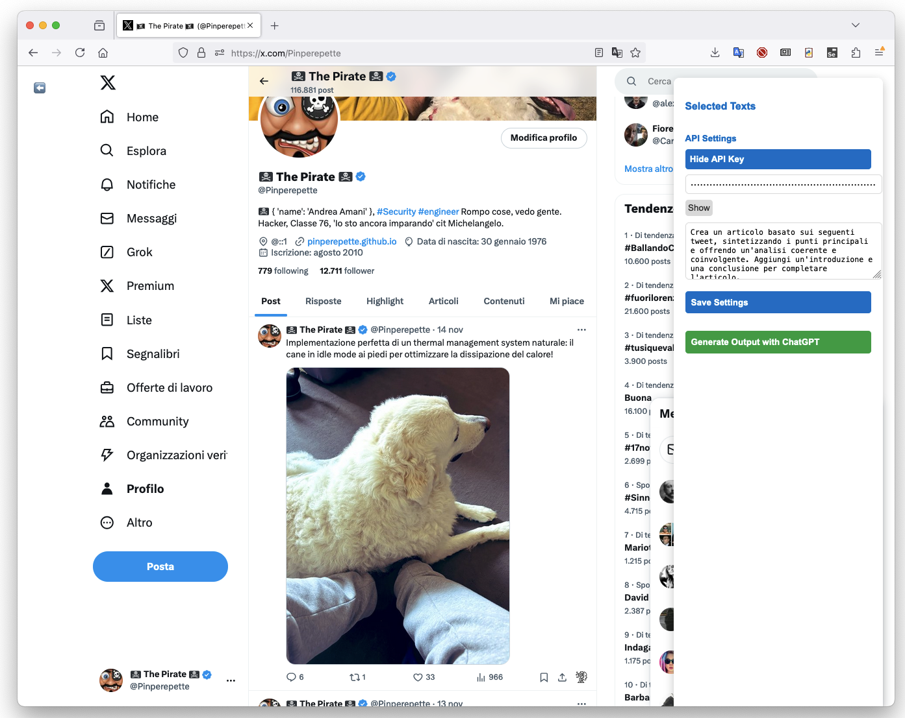

# Tweet Selector Extension

This is a browser extension for selecting and saving tweet texts directly from Twitter (now X.com) pages. The selected texts can be used to generate content through the ChatGPT API.

## Features

- **Select Tweets**: Easily select tweets on X.com and save their text.
- **Sidebar Interface**: A clean and simple sidebar displays all selected texts.
- **ChatGPT Integration**: Generate content based on selected tweets using the ChatGPT API.
- **API Settings**: Configure and save your API key and custom prompts for ChatGPT.
- **Toggle Sidebar**: Show or hide the sidebar for a distraction-free experience.

## Screenshots

### 1. Main Interface

### 2. Selecting Tweets

### 3. API Settings

## Installation

1. Clone this repository or download the source code.
2. Open your browser and navigate to the extensions settings (e.g., `about:debugging` in Firefox).
3. Load the extension by selecting the `manifest.json` file in the source code folder.

## Usage

1. Visit X.com (or Twitter.com) and browse tweets.
2. Click the **Select** icon under any tweet to add its text to the sidebar.
3. View and manage selected texts in the sidebar on the right.
4. Configure your ChatGPT API settings to generate content based on selected tweets.
5. Click the **Generate Output with ChatGPT** button to see the results.

## Configuration

- **API Key**: Enter your OpenAI API key in the settings section of the sidebar.
- **Custom Prompt**: You can create and save a custom prompt to guide the output from ChatGPT.

## Requirements

- A modern web browser that supports extensions (Firefox recommended).
- An OpenAI API key for accessing ChatGPT.

## Contributing

Feel free to open issues or submit pull requests if you have suggestions or improvements.

## License

This project is licensed under the MIT License. See the LICENSE file for more details.
